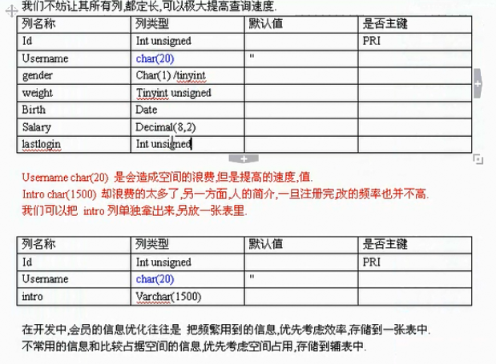
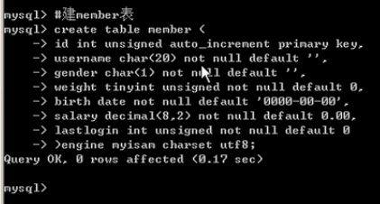

## 生命周期函数
>最开始的生命周期函数   beforeCreate   //这是我们遇到的第一个生命周期函数,表示实例完全被创建出来之前,会执行它
            ——————————————————————————————————
>第二个生命周期函数 created  //这是第二个周期函数 （重点）       // 在created 中 , data 和 methods 都已经被初始化好了 所以值才能被调用出来
                    // 如果需要调用 methods 中的方法 , 或者操作 data 中的数据 , 最早只能在 created 中操作
            ——————————————————————————————————
>第三个生命周期函数 beforeMount   // 在beforeMount 执行的时候,页面中的元素,还没有被真正替换过来,只是写了一些模板字符串
            ——————————————————————————————————
>第四个生命周期函数 mounted //这是遇到的第4个生命周期函数,表示,内存中的模板,已经真实的挂载到了页面中,用户
                        // 已经可以看到渲染好的页面了
                        // 注意: mounted 是 实例创建期间的最后一个生命周期函数,当执行完 mounted 就表示,实例已经被
                // 完全创建好了,此时,如果没有其他操作的话,这个实例,就静静的,躺在内存中,一动不动
                ——————————————————————————————————
>要知道的生命周期函数 beforeMount   //这时候 表示 我们的界面还没有被更新 【数据被更新了吗? 数据肯定要被更新了】
 //得出结论: 当执行beforeUpdate的时候,页面中的显示的数据,还是旧的,此时
                //data 数据是最新的,页面尚未和 最新的数据保持同步
  ——————————————————————————————————
  >updated 生命周期函数       //updated 事件执行的时候,页面和data数据已经保持同步了,都是最新的

### vue-resource  和 服务器创建连接  (重点)
>通用接口代码: 'http://jsonplaceholder.typicode.com/users'

## 如何创建egg脚手架
>第一步 npm i egg-init -g 下载一个全局依赖
第二步 egg-init dome01 --type=simple 创建egg文件名字叫dome01
第三步 cd dome01 进入创建的dome01里面
第四步 npm i  下载以来 运行项目

## egg结构
>把页面实现的效果代码都写在App这个文件中,如果要配置文件都写在config文件下
controller 用来存放js文件 
controller就是经典的MVC（module，view，controller）架构中的controller层，主要用来解决实际的业务逻辑
public 用来存放静态资源 比如html文件、css文件和js文件、img图片
view 存放着html文件 渲染完毕后 模板都放在这里
router 是在控制器中获取路由 实现跳转功能
页面中循环的写法
`<ul>
    
    <li>
      <a href="{{item.url}}">{{item.title}}</a>
    </li>
    
  </ul>
`

## egg学习(案例)
>dome1 简单更改显示内容
dome2 通过下载模板来使用或配置模板
dome3 egg基本语法(基础)
dome4 继承模板
dome5 引入js文件

## MySQBa数据库(笔记)
>数据库背景知识
1.数据+库:将信息(数据)按照计算机可识别的方式规则存放在磁盘库中,并提供一系列可供读写的方式
2.相比较于磁盘文件,数据库最大的优点是提供了非常灵活的接口、方式可以 获取完整数据或者特定部分数据的方式(SQL); 并提供了一套完整的管理数据的方法(存粗结构，备份恢复等)
3.为什么要存粗数据？
(1)数据要随时随地反复使用,不是一次性消耗品
(2)数据要被记录,防止遗忘

>数据库在企业中的使用
1.企业无论大小,其日常经营活动都会涉及到数据库,尤其是互联网公司,都会选择数据库作为储存数据的重要甚至唯一渠道,这些数据涵盖方方面面:
(1)客户数据
(2)员工数据
(3)财务数据
(4)交易数据
(5)物流数据
(6)运营数据
等等

>常见的数据库类型
1.关系型数据库类型
(1)目前市场上占主要份额的数据库类型,以二维表格(行和列,类似excel)来存储数据,表格与表格之间的数据关系用字段引用来表示
(2)Oracle,SQK server,MySQL,DB2等
2.非关系性数据库类型
(1)出现时间较短,抛弃关系型死板的数据存储方式,提供了更加灵活的方式
(2)面向高性能并发读写的key-value数据库:
   key-value数据库的主要特点即使具有极高的并发读写性能, Redis,Tokyo Cabinet,Flare就是这类的代表
3.面向海量数据访问的文档数据库:
  这类数据库的特点是,可以在海量的数据中快速的查询数据, 典型代表为MongoDB以及CouchDB
4.面向可扩展性的分布式数据库:
  这类数据库想解决的问题就是传统数据库存在可扩展性上的缺陷, 典型代表为Cassandra等
5.数据库类型在企业中的选择
(1)常用数据会存放在关系数据库中
(2)逐步考虑使用非关系型数据库作为部分业务的支持
### 但 关系数据库还是主流

## MySQL数据库介绍
1.MySQL是一种开放源代码的关系型数据库管理系统,MySQL数据库系统使用最常用的数据库管理语言--结构化查询语言(SQL)进行数据库管理
2.MySQL的历史最早可追溯到1979年,那时Oracle也才刚刚开始,微软的SQL server影子都没有
3.在2008年1月16号MySQL被sun公司收购
4.2009年,SUN又被Oracle收购
(重点)体积小、速度快、总体拥有成本低, 尤其是开放源码这一特点,使许多企业选择了MySQL作为数据库

#### 数据库是一个逻辑对象
>表table:数据库对象中的一种,用来存储相同属性的数据,类似于Excel中的sheet
字段field, 列column, 属性attribute: 表中数据的组成部分,类似于Excel中的列
类型type:每个字段属性之一,代表该字段下的所有数据以什么形式呈现,比如整数,字符串等类型
键值key:数据表的一个属性,可以指定主键,外键
索引index:在数据库管理系统中通常为加速数据读取速度而创建的一种数据结构
视图view:为(字面上)简化部分数据的获取方法而创建的定义
存储过程sp(stored procedure):在数据库内部创建的具有一系类数据处理逻辑的方法
触发器trigger:当数据表发生修改操作时自动触发某些数据处理方法
查询select、修改update、删除delete、添加、insert,这些都是SQL对数据库中数据进行操作、管理的一套语法
数据库架构:指数据库设计工作中对数据库一个或多个案例的部署,之间的数据协同,高可用性,并发行等特性搜做的统一规划

#### mySQL数据库 官方安装网站 https://dev.mysql.com/downloads/mysql
MySQL代码结尾一定要加; 如果不加则一直运行 没有效果
>创建一个course数据库:create database course;

####入门最基本语句
>Mysql -username -password 来连接
当连上服务器后,我们首先面对的是？
库有一个或者多个,因此我们要相对表或者行做操作的话,
要先选库.

选库语句: Use 库名

查看所有库:show databases;

选上库我们面对的是表

查看库下面的所有表:show tables;

创建数据库:create database 数据库名 [charst 字符集]

删除一个数据库：drop database 数据库名；

把数据库改名?
Mysql中,表可以改名,database不可以

简单的建表语句:create table stu (
  snum int,
  sname varchar(10)
)engine myisam charset utf8;
engine是指表引擎,和性能特点相关

删除表:drop table stu;

修改表名:rename table stu to newstu;

清空表数据:truncate 表名字;

truncate 和 delete 是有区别的:在于truncate相当于删表在重建一张同结构的表,操作后得到一张全新得表,而delete是从删除所有的层面来操作的,
如果决定全清空的情况下,truncate速度快一些

如果出现乱码,告诉服务器,客户端使用的GBK编码
set names gbk;

tee D:\1010.sql :建立一个mysql数据库笔记
tee:这句话是把我敲的sql 及结果都输出到一个sql文件里来复习
接下来我们学习增删 盖改查基本语法,得先有一张表,才行.
先创建一张班级薪水登记表
create table class(
  id int primary key auto_increment,
  sname varchar(10) not null default '',
  gender char(1) not null default '',
  company varchar(20) not null default '',
  salary decimal(6,2) not null default '',
  fanbu smallint not null default 0
)engine myisam charset utf8;

查看一下class表的结构:desc class;

往哪张 表添加行 class表
填哪几行(id,sname,gender,company,salary,fanbu)
分别添加什么值(1,'张三','男','百度',9999,234)

insert into class
(id,sname,gender,company,salary,fanbu)
values
(1,'张三','男','百度',9999,234);

id在上例中虽然没有插入,但id是自增型,因此值为2
回头再来看,插入所有列的情况 如果插入所有列,则可以干脆不声明待插入的列,
即,如果不声明插入的列,则理解为依次插入所有列

添加多行
insert into class
(sname,company,salary)
values
('刘备','皇室成员',15.28),
('孙策','京东集团',56.34),
('曹操','宦官后裔',88.56);

如上是增
________________________________________________
练习改 update
---update 改的要素
改哪张表 : class
改哪几列 : gender,company
改成什么值:'女','千度'

update class
set 
gender='女',
company='千度';

where 就只能用id=N这种形式
这是错误的理解
where expression,表达式.
只要where 表达式为真,则改行就发挥作用

改性别为男,且工资>8000的用户
update class
set fanbu=159
where gender='男' and salary>8000;

update class set fanbu=99 where 1;这句话什么意思
因为where 1中的1,恒为真,所以取了所有行

如上是改
_____________________________________
====删除的学习==== 
 删除 就是指删除整行,不存在删除一行中的某几列

 ====删除要素====
 删哪张表的数据:class
 删哪几行:where expression 

把salary大于8800的用户选出来
 delete from class where salary>8800

 Query OK , 说明执行成功了. 0 rows afftected,删除了0行.

如上是删

====查询要素====
查哪张表的数据?class
查哪些列?sname,salary,company

最暴力的查询
select * from class;
*代表所有列,表明后不加where条件 则选择所有行
因此取出所有行,所有列.

部分列,所有行. 取所有人的姓名和工资
select sname,salary from class;

查出id>3的所有列
select * from class where id>3;

取部分行 部分列 

_________________________________
====上面是最近本的曾删改查====
针对单个表来说

====后面要学什么====
如何自己建表?
如何修改表(增加减少列等)
多表联查
子查询
触发器
事物
存储过程
备份恢复

#####建表过程与字符串类型的意义
目的要学会建表.
知识点:列类型

如何建表:以在A4纸上建表为例
其实建表的过程,就是一个画表头的过程,
从术语上讲有4个列,
建表的过程就是一个====声明字段、表头、列====的过程

那么建表和列类型又有什么关系呢?
分析:再看上面的表,A4纸是数据的存储空间,而A4的大小是有限的
请问:你准备给学号留多宽？给姓名留多宽？自我介绍留多宽？

自然的,姓名如果留的过宽,比如20个字都能存,但是一般的姓名,就三四字---浪费了,如果留的过窄,导致存不下,更有问题

对应的.A4纸空间有限,硬盘空间也有限.
我们建列时,自然想的是------能够容纳放置的内容,但是又不浪费.

====存储同样的数据,不同的列类型,所占据的空间和效率是不一样的--这就是我们建表前要学列类型的意义====

所以---重点学列类型的存储范围与占据的字节关系.

______________________________________________________________
MySQL三大列类型
数值型
  整形
  Tinyint
          占据空间:1字节,存储范围:-128至127,0至255
  Smallint
          占据空间:2字节,存储范围:-32768至32767,0至65535          
  mediuint 
          占据空间:3字节,存储范围:-8388608至8388607,0至16777215           
  Int     
          占据空间:4字节,存储范围:-2147483648至2147483647,0至4294967295   
  bigint
          占据空间:8字节
  小数(浮点型/定点型)

  ====一个字节 8个位 0 - 2^8-1  ,  0-255
                -2^7 ----> +2^7-1
  ====

  分析:
  2个字节 , 16为 0----2^16-1 = 65535
        -2^15 --->  +2^15-1  ,  -32768 = 32767

  一般而言,设某类型  N字节
  N字节 , 8N位.
  0 ----> 2^8N-1
  -2^(8N-1) ---> +2^(8N-1)-1

  声明 tinyint 怎么让他0-255,有怎么让他 -128 至 +127

  int系列的声明时的参数
  (M) upsigned zerofill

计算机为了表示一个数是负数,会把最高位(左侧)的0/1,当成符号看.如为0,则是整数,如为1,则是负数.

对于 int 型 : 占得字节越多,存储的范围越大

宽度与空位补零
alter table class snum smallint(5) zerofill not null default 0;
增加一行数据 增加的表是class表 数据名称是snum smallint(2字节)后面的5是具体的宽度 not 空 未定义 没有值得都用0;

snum统一补0，而且补到5位.
为什么补到5位,因为M为5.
总结 M表示补0宽度.和zerofill配合才有意义.

上面是具体范围(整数{字节})类型
_________________________________________________
浮点数在计算机里表示比较复杂.
IEEE
Float(M,D),decimal(M,D)
M叫'精度' --->代表'总位数',而D是'标度',代表小数位(小数右边的数)

float(6,2) 

浮点数占多大空间呢?
答:  float  能存 10^ 3 8 ,  10^-38
如果M<=24,点则是24个字节,否则占8字节

用来表示数据中的小数除了float---浮点
还有一种叫定点(decimal),定点是把整数部分,和小数部分,分开存储的.
他比float精确.

float会有损精度  银行等比较敏感的字段建议用decimal

以上是小数类型
______________
接下来学习char、varchar、text、blob
char 和varchar分别称为定长和变长类型

对于定长N
不论够不够长度,实际都占N个长度
如果不够N个长度,用空格在末尾补至N个长度

char(6) 定长字符串 
00\0\0\0\0(char类型,如果不够M个字符,内部用空格补齐,取出时再把右侧空格删掉)

查找记录时,如果都是定长,完全可以通过行数与行的长度计算出来,文件指针的偏移量

速度上:定长速度快些

注意:char(M),varchar(M)限制的是字符,不是字节.
即 char(2)charset utf8,能存2个 utf8 字符 , 比如'中国'.

以上是字符串类型
_____
Text:文本类型,可以存比较大的文本段,搜索速度稍慢.
因此,如果不是特别大的内容,建议用 char, varchar 来代替.
Text 不用加默认值 (加了也没用)
以上是Text类型
____
Blob,是二进制类型,用来存放图像,音频等二进制信息
意义:2进制,0-255都有可能出现.
Blob在于防止因为字符集的问题,导致的信息丢失
比如:一张图片有0xFF字节,这个在ascii字符集认为非法,在入库的时候,被过滤了.

以上是blob类型内容
_________________________________________________________________
列类型  存储要求

Date  3个字节
Datetime 8个字节
Timestamp  4个字节
Time 3个字节
Year 1个字节(还可以存0000年)

以上是日期时间类型

====计算机程序优化的世界里无非就是:空间换时间或者时间换空间====

建表语法
所谓建表就是是一个声明列的过程.
create table 表名(
列1的声明 列类型1 列1的参数,
列2声明 列类型2 列2参数,
....
...
列n声明 列类型n 列n参数
)engine myisam/innodb/bdb charset utf8/gbk/latin1...(表声明)

建一张统一规范的数据表

_________
作业:让我们建一个电子商城,如何来设计电子表

__________
#### 修改表的语法
>一张表创建完毕,有了N列.
之后还有可能要增加或删除或修改列
alter table 表名 add 列名称 列类型 列参数[加的列在表的最后]
例:Alter table mi add birth date not null default '0000-00-00'
Alter table 表名 add 列名称 列类型 列参数 alter 某列 [把列添加在某列后]
例:alter table mi add gender char(1) not null default '' after username
Alter table 表名 add 列名称 列类型 列参数 first[把新列加在最前面]
alter table mi add pid int not null default 0 first;
_____________________________
#### 删除列
alter table 表名 drop pid

#### 修改列
Alter table 表名 modify 列名 新类型
alter table mi modify gender char(4) not null default '',

修改列名及列类型
Alter table 表名 change 新列名 新类型 新参数
__________________________
学到16章
###查询条件（Mysql从入门到精通以此中断）转一天学会mysql

###一天学会mysql笔记
增加:insert
删除:delete
修改:update
查询:select

Mysql建表约束

--主键约束

它能够唯一确定一张表中的一条记录,也就是我们通过给某个字段添加约束,就可以使得改字段不重复也不能为空

create table user (
  id int primary key,
  name varchar(20)
);
insert into user values(1,'张三')

-- 联合主键
create table user2 (
  id int ,
  name varchar20(),
  password varcahr(20),
  primary key(id,name)
);

insert into user2 values(1,'张三')
====联合主键id不可以为空====

--唯一约束(unique)
-- 约束修饰的字符的值不可以重复

create table user5(
  id int,
  name varchar(20)
);

alter table user5 add unique(name);

+-------+-------------+------+-----+---------+-------+
| Field | Type        | Null | Key | Default | Extra |
+-------+-------------+------+-----+---------+-------+
| id    | int(11)     | YES  |     | NULL    |       |
| name  | varchar(20) | YES  | UNI | NULL    |       |
+-------+-------------+------+-----+---------+-------+
2 rows in set (0.00 sec)

insert into user5 values(1,'张三')

mysql> insert into user5 values(1,'zhagnsan');
Query OK, 1 row affected (0.01 sec)

mysql> insert into user5 values(1,'zhagnsan');
ERROR 1062 (23000): Duplicate entry 'zhagnsan' for key 'name'
====报错报的是张三插入两条重复了====

直接增加唯一约束
mysql> create table user6(
    -> id int,
    -> name varchar(20),
    -> unique(name)
    -> );
Query OK, 0 rows affected (0.03 sec)

mysql> desc user6;
+-------+-------------+------+-----+---------+-------+
| Field | Type        | Null | Key | Default | Extra |
+-------+-------------+------+-----+---------+-------+
| id    | int(11)     | YES  |     | NULL    |       |
| name  | varchar(20) | YES  | UNI | NULL    |       |
+-------+-------------+------+-----+---------+-------+
2 rows in set (0.01 sec)

-- unique(id,name) 表示两个键在一起不重复就可以
mysql> desc user8;
+-------+-------------+------+-----+---------+-------+
| Field | Type        | Null | Key | Default | Extra |
+-------+-------------+------+-----+---------+-------+
| id    | int(11)     | YES  | MUL | NULL    |       |
| name  | varchar(20) | YES  |     | NULL    |       |
+-------+-------------+------+-----+---------+-------+
2 rows in set (0.01 sec)
insert into user8 values (1,'zhangsan')
insert into user8 values (1,'zhangsan')

-- 如何删除唯一约束
alter table user7 drop index name;

mysql> alter table user6 drop index name;
Query OK, 0 rows affected (0.02 sec)
Records: 0  Duplicates: 0  Warnings: 0

mysql> desc user6;
+-------+-------------+------+-----+---------+-------+
| Field | Type        | Null | Key | Default | Extra |
+-------+-------------+------+-----+---------+-------+
| id    | int(11)     | YES  |     | NULL    |       |
| name  | varchar(20) | YES  |     | NULL    |       |
+-------+-------------+------+-----+---------+-------+
2 rows in set (0.00 sec)

-- 通过 modifu 添加
alter table user6 modify name varchar(20) unique;
Query OK, 0 rows affected (0.02 sec)
Records: 0  Duplicates: 0  Warnings: 0

mysql> desc user6;
+-------+-------------+------+-----+---------+-------+
| Field | Type        | Null | Key | Default | Extra |
+-------+-------------+------+-----+---------+-------+
| id    | int(11)     | YES  |     | NULL    |       |
| name  | varchar(20) | YES  | UNI | NULL    |       |
+-------+-------------+------+-----+---------+-------+
2 rows in set (0.00 sec)

-- 总结:
-- 1建表的时候就添加约束
-- 2、可以使用alter ... add ...
-- 3、alter ... modify ...

-- 4、删除 alter ... drop ...

--非空约束 not null 
-- 修饰的字段不能为空 NULL

create table user9(
  id int,
  name varchar(20) not null
);

+-------+-------------+------+-----+---------+-------+
| Field | Type        | Null | Key | Default | Extra |
+-------+-------------+------+-----+---------+-------+
| id    | int(11)     | YES  |     | NULL    |       |
| name  | varchar(20) | NO   |     | NULL    |       |
+-------+-------------+------+-----+---------+-------+
2 rows in set (0.00 sec)

insert into user9 (id) values(1);
ERROR 1364 (HY000): Field 'name' doesn't have a default value

insert into user9 values(1,'zhangsan');
select * from user9

mysql> select * from user9;
+------+----------+
| id   | name     |
+------+----------+
|    1 | zhangsan |
+------+----------+
1 row in set (0.00 sec)

insert into user9 (name) values('zhangsan');
select * from user9

mysql> select * from user9;
+------+----------+
| id   | name     |
+------+----------+
|    1 | zhangsan |
| NULL | zhangsan |
+------+----------+
2 rows in set (0.00 sec)

-- 加上非空约束 如果为空的话就会出错

--默认约束

-- 就是当我们插入字段值的时候,如果没有传值,就会使用默认值

create table user10(
  id int,
  name varchar(20),
  age int default 10
);

mysql> create table user10(
    ->   id int,
    ->   name varchar(20),
    ->   age int default 10
    -> );
Query OK, 0 rows affected (0.02 sec)

mysql> desc user10;
+-------+-------------+------+-----+---------+-------+
| Field | Type        | Null | Key | Default | Extra |
+-------+-------------+------+-----+---------+-------+
| id    | int(11)     | YES  |     | NULL    |       |
| name  | varchar(20) | YES  |     | NULL    |       |
| age   | int(11)     | YES  |     | 10      |       |
+-------+-------------+------+-----+---------+-------+
3 rows in set (0.00 sec)

insert into user10 (id,name) values(1,'zhangsan');

====默认约束：如果传了值就不会使用默认值====

--自增约束
create table user3(
  id int primary key auto_increment,
  name varchar(20)
);

insert into user3 (name) values('张三')
====不填写ID自动补充====

-- 如果说我们创建表的时候,忘记创建主键约束了? 该怎么办?
-- 修改表结构 , 添加主键
alter table user4 add primary key(id)
把user4当中的id这条数据添加上primary key的主键约束

-- 如何删除?
alter table user4 drop primary kry;

-- 使用 modify 修改字段, 并添加约束
ater table user4 modify id int primary key;

--外键约束
-- 涉及到两个表: 父表, 子表
主表,副表.

-- 班级
create table classes(
  id int primary key,
  name varchar(20)
);

-- 学生表
create table students(
  id int primary key,
  name varchar(20),
  class_id int,
  foreign key(class_id) references classes(id)
);

给主表 班级表插入数据
insert into classes values (1,'一班');
insert into classes values (2,'二班');
insert into classes values (3,'三班');
insert into classes values (4,'四班');

给副表插入数据
insert into students values(1001,'张三',1);
insert into students values(1002,'张三',2);
insert into students values(1003,'张三',3);
insert into students values(1004,'张三',4);

mysql> insert into students values(1005,'zhangsan',5);
ERROR 1452 (23000): Cannot add or update a child row: a foreig
ails (`course2`.`students`, CONSTRAINT `students_ibfk_1` FOREI
) REFERENCES `classes` (`id`))

--1 主表(父表) classes 中没有的数据值,在副表(子表)中是不可以使用的.
--2 指标中的记录被副表引用,不是不可以被删除的

delete from classes where id=4; 删除classes这个表中 id为4的这一行

mysql> delete from classes where id=4;
ERROR 1451 (23000): Cannot delete or update a parent row: a foreign key con
nt fails (`course2`.`students`, CONSTRAINT `students_ibfk_1` FOREIGN KEY (`
_id`) REFERENCES `classes` (`id`))

总结:外键约束主要是有两个表,然后一个表中的记录会被另一个表引用,而且你在添加数据或者删除数据的时候会有限制(外键约束)

-- 数据库测三大设计范式
-- 1.第一范式
-- 1NF

数据表中的所有字段都是不可分割的原子值?

create table student2(
  id int primary key,
  name varchar(20),
  address varchar(30)
);

insert into student2 values (1,'张三','中国四川省成都市武侯区武侯大道100号');
insert into student2 values (2,'张三','中国四川省成都市武侯区武侯大道200号');
insert into student2 values (3,'张三','中国四川省成都市武侯区武侯大道90号');

mysql> select * from student2;
+----+------+-------------------------------------+
| id | name | address                             |
+----+------+-------------------------------------+
|  1 | 张三 | 中国四川省成都市武侯区武侯大道100号 |
|  2 | 张三 | 中国四川省成都市武侯区武侯大道200号 |
|  3 | 张三 | 中国四川省成都市武侯区武侯大道90号  |
+----+------+-------------------------------------+
3 rows in set (0.00 sec)

-- 字段值后可以继续拆分,就不满足第一范式

create table student3(
  id int primary key,
  name varchar(20),
  cuntry varchar(20),
  privence varchar(30),
  city varchar(30),
  details varchar(30)
);

insert into student3 values(1,'张三','中国','四川省','成都市','武侯区大道100号');
insert into student3 values(2,'李四','中国','四川省','成都市','武侯京城大道200号');
insert into student3 values(3,'王五','中国','四川省','成都市','高新区天府大道90号');

mysql> select * from student3;
+----+------+--------+----------+--------+--------------------+
| id | name | cuntry | privence | city   | details            |
+----+------+--------+----------+--------+--------------------+
|  1 | 张三 | 中国   | 四川省   | 成都市 | 武侯区大道100号    |
|  2 | 李四 | 中国   | 四川省   | 成都市 | 武侯京城大道200号  |
|  3 | 王五 | 中国   | 四川省   | 成都市 | 高新区天府大道90号 |
+----+------+--------+----------+--------+--------------------+
3 rows in set (0.00 sec)

-- 范式,设计的越详细,对于某些实际操作可能更好,但是不一定都是好处。

-- 2、第二范式
-- 必须是满足第一范式的前提下,第二范式要求,除主键外的每一列都必须完全依赖于主键.
-- 如果要出现不完全依赖,只可能发生在联合主键的情况下

-- 订单表

create table myorder (
  product_id int,
  customer_id int,
  product_name varchar(20),
  customer_name varchar(20),
  primary key(product_name,customer_name)
);

-- 问题?
-- 除主键以外的其他列,只依赖与主键的部分字段
-- 拆表

create table myorder (
  order_id int primary key,
  product_id int,
  customer_id int,
);

create table product(
  id int primary key,
  name varchar(20)
);

create table customer(
  id int primary key,
  name varchar(20)
);

-- 分成三个表之后,就满足了第二范式的设计！！

-- 3、第三范式
-- 3NF
-- 必须先满足第二范式,除开主键列的其他列之间不能有传递依赖关系.

-- mysql查询练习
学生表
Student
学号
姓名
出生年月日
所在班级
create table student(
  sno varchar(20) primary key,
  sname varchar(20) not null,
  ssex varchar(10) not null,
  sbirthday datetime,
  calss varchar(20)
);

课程表
Course
课程号
课程名称
教师编号
create table course(
  cno varchar(20) primary key,
  cname varchar(20) not null,
  tno varchar(20) not null,
  foreign key(tno) references teacher(tno)
);

教师表
Teacher
教师编号
教师名字
教师性别
出生年月日
职称
所在部门
create table teacher(
  tno varchar(20) primary key,
  tname varchar(20) not null,
  tsex varchar(10) not null,
  tbirthday datetime,
  prof varchar(20) not null,
  depart varchar(20) not null
);

成绩表
Score
学号
课程号
成绩
create table score(
  sno varchar(20) not null,
  cno varchar(20) not null,
  degree decimal,
  foreign key(sno) references student(sno),
  foreign key(cno) references course(cno)
);

-- 往数据表添加数据
添加学生信息
insert into student values('108','曾华','男','1977-01-01','95033');
insert into student values('105','匡明','男','1975-01-01','95031');
insert into student values('107','王丽','女','1976-01-01','95033');
insert into student values('101','李军','男','1976-01-01','95033');
insert into student values('109','王芳','女','1974-01-01','95031');
insert into student values('103','陆军','男','1977-01-01','95031');
insert into student values('102','陆军','男','1977-01-01','95031');
insert into student values('104','陆军','男','1977-01-01','95031');
insert into student values('106','陆军','男','1977-01-01','95031');

添加教师表
insert into teacher values('804','李成','男','1977-01-01','副教授','计算机系');
insert into teacher values('856','张旭','男','1977-01-01','副教授','计算机系');
insert into teacher values('825','王萍','男','1977-01-01','副教授','计算机系');
insert into teacher values('831','溜冰','男','1977-01-01','副教授','计算机系');

添加课程表
insert into course values('3-155','高等数学','831');
insert into course values('4-155','高等数学','831');
insert into course values('5-155','高等数学','831');
insert into course values('6-155','高等数学','831');

添加成绩表
insert into score values('103','3-245','86');
insert into score values('103','3-105','92');
insert into score values('105','3-245','75');
insert into score values('109','3-245','68');
insert into score values('105','3-105','88');
insert into score values('109','3-105','76');
insert into score values('103','6-166','85');
insert into score values('105','6-166','79');
insert into score values('109','6-166','81');

-- 查询练习
-- 1、 查询student表的所有记录.
mysql>  select * from student;
+-----+-------+------+---------------------+-------+
| sno | sname | ssex | sbirthday           | calss |
+-----+-------+------+---------------------+-------+
| 101 | 李军  | 男   | 1976-01-01 00:00:00 | 95033 |
| 102 | 陆军  | 男   | 1977-01-01 00:00:00 | 95031 |
| 103 | 陆军  | 男   | 1977-01-01 00:00:00 | 95031 |
| 104 | 陆军  | 男   | 1977-01-01 00:00:00 | 95031 |
| 105 | 匡明  | 男   | 1975-01-01 00:00:00 | 95031 |
| 106 | 陆军  | 男   | 1977-01-01 00:00:00 | 95031 |
| 107 | 王丽  | 女   | 1976-01-01 00:00:00 | 95033 |
| 108 | 曾华  | 男   | 1977-01-01 00:00:00 | 95033 |
| 109 | 王芳  | 女   | 1974-01-01 00:00:00 | 95031 |
+-----+-------+------+---------------------+-------+
9 rows in set (0.00 sec)

-- 2、 查询student表中所有记录的snmae、ssex和class列
select sname,ssex,calss from student;
+-------+------+-------+
| sname | ssex | calss |
+-------+------+-------+
| 李军  | 男   | 95033 |
| 陆军  | 男   | 95031 |
| 陆军  | 男   | 95031 |
| 陆军  | 男   | 95031 |
| 匡明  | 男   | 95031 |
| 陆军  | 男   | 95031 |
| 王丽  | 女   | 95033 |
| 曾华  | 男   | 95033 |
| 王芳  | 女   | 95031 |
+-------+------+-------+
9 rows in set (0.00 sec)

-- 3、 查询教师所有的单位即不重复的depart列
mysql> select distinct depart from teacher;
+----------+
| depart   |
+----------+
| 计算机系 |
+----------+
1 row in set (0.00 sec)
用了distinct 查询的就不是重复的了

-- 4、 查询score表中成绩在60到80之间的所有记录
-- 查询区间 between ... and ... 是查询什么到什么之间
select * from score where degree between 60 and 80;

-- 直接使用运算符比较
另一种方法:select * from score where degree >60 and degree < 80

-- 5、 查询score表中成绩为85,86或88的记录
-- 表示或者关系的查询 in
select * from score where degree in(85,86,88);

-- 6、 查询student表中'95031'班或性别为'女'的同学记录
-- or 表示或者
select * from student where calss='95031' or ssex='女';

-- 7、 以class降序查询student表的所有记录
-- 升序,降序
select * from student order by calss desc;
+-----+-------+------+---------------------+-------+
| sno | sname | ssex | sbirthday           | calss |
+-----+-------+------+---------------------+-------+
| 101 | 李军  | 男   | 1976-01-01 00:00:00 | 95033 |
| 107 | 王丽  | 女   | 1976-01-01 00:00:00 | 95033 |
| 108 | 曾华  | 男   | 1977-01-01 00:00:00 | 95033 |
| 102 | 陆军  | 男   | 1977-01-01 00:00:00 | 95031 |
| 103 | 陆军  | 男   | 1977-01-01 00:00:00 | 95031 |
| 104 | 陆军  | 男   | 1977-01-01 00:00:00 | 95031 |
| 105 | 匡明  | 男   | 1975-01-01 00:00:00 | 95031 |
| 106 | 陆军  | 男   | 1977-01-01 00:00:00 | 95031 |
| 109 | 王芳  | 女   | 1974-01-01 00:00:00 | 95031 |
+-----+-------+------+---------------------+-------+
9 rows in set (0.00 sec)

-- asc; 升序(末尾不加 默认升序);
mysql> select * from student order by calss;
+-----+-------+------+---------------------+-------+
| sno | sname | ssex | sbirthday           | calss |
+-----+-------+------+---------------------+-------+
| 102 | 陆军  | 男   | 1977-01-01 00:00:00 | 95031 |
| 103 | 陆军  | 男   | 1977-01-01 00:00:00 | 95031 |
| 104 | 陆军  | 男   | 1977-01-01 00:00:00 | 95031 |
| 105 | 匡明  | 男   | 1975-01-01 00:00:00 | 95031 |
| 106 | 陆军  | 男   | 1977-01-01 00:00:00 | 95031 |
| 109 | 王芳  | 女   | 1974-01-01 00:00:00 | 95031 |
| 101 | 李军  | 男   | 1976-01-01 00:00:00 | 95033 |
| 107 | 王丽  | 女   | 1976-01-01 00:00:00 | 95033 |
| 108 | 曾华  | 男   | 1977-01-01 00:00:00 | 95033 |
+-----+-------+------+---------------------+-------+
9 rows in set (0.00 sec)

-- 8、 以cno升序、degree降序查询score标的所有记录
select * from score order by cno asc,degree desc;

-- 9、 查询'95031'班的学生人数
-- 统计 count
select count(*) from student where calss='95031';

-- 10、 查询score表中的最高分的学生学号和课程号.(子查询或者排序)
select sno,cno from score where degree=(select max(degree) from score);

-- 1 找到最高分
select max(degree) from score;

-- 2 找到最高分的 sno 和 cno
select sno,cno from score where degree=(select max(degree) from score);

-- 排序的做法
select sno,cno from score order by degree desc limit 0,1;
-- Limit 第一个数字表示从多少开始
-- 第二个数字表示查多少条

-- 11、 查询每门课的平均成绩

select * from course;

-- avg()
select avg(degree) from score where cno='3-105';

-- 我们能不能在一个 sql 语句中写呢?
-- group by 分组
select cno,avg(degree) from score group by cno;

-- 12、 查询score表中至少有两名学生选修的并以3开头的课程平均分数.
select cno from score
group by cno
having count(con)>=2 
and con link '3%';

-- 13、 查询分数大于70,小于90的sno列
select sno,degree from score
where degree between 70 and 90;

-- where degree>70 and degree<90;

-- 14、查询所有学生的 sname 、 cno 和 degree 列

select sname,cno,degree from student,score where student.sno = score.sno;(俩个表相结合{多表联查})

select son,sname from student;
+-------+
| sname |
+-------+
| 李军  |
| 陆军  |
| 陆军  |
| 陆军  |
| 匡明  |
| 陆军  |
| 王丽  |
| 曾华  |
| 王芳  |
+-------+
9 rows in set (0.00 sec)

select cno,degree from 

-- 15、查询所有学生的sno、cname和degree列.
mysql> select cno,cname from course;
+-------+----------+
| cno   | cname    |
+-------+----------+
| 3-155 | 高等数学 |
| 4-155 | 高等数学 |
| 5-155 | 高等数学 |
| 6-155 | 高等数学 |
+-------+----------+
4 rows in set (0.00 sec)

select cno,sno,degree from score;

select son,sname,degree from course,score where score.cno = course.cno;
(多表查询)通过俩表之间共同的字段来替换内容 从而达到想要的效果

-- 16、查询所有学生的sname、cname和degree列

-- sname => student
-- cname => course
-- degree => score

select sname,cname,degree from student,course,score
where student.sno=score.son 
and course.con = score.con;

结论:多表联查是通过取多个表中对应的字段,取出来放在一张新表中
视频(取相同的字段,放在同一个表中 where student.con = course.con)

-- 17、查询'95031'班学生每门课的平均分

select * from student where calss='95031';
+-----+-------+------+---------------------+-------+
| sno | sname | ssex | sbirthday           | calss |
+-----+-------+------+---------------------+-------+
| 102 | 陆军  | 男   | 1977-01-01 00:00:00 | 95031 |
| 103 | 陆军  | 男   | 1977-01-01 00:00:00 | 95031 |
| 104 | 陆军  | 男   | 1977-01-01 00:00:00 | 95031 |
| 105 | 匡明  | 男   | 1975-01-01 00:00:00 | 95031 |
| 106 | 陆军  | 男   | 1977-01-01 00:00:00 | 95031 |
| 109 | 王芳  | 女   | 1974-01-01 00:00:00 | 95031 |
+-----+-------+------+---------------------+-------+
6 rows in set (0.00 sec)

select sno from student where calss='95031';

select * from score where sno in ( select sno from student where calss='95031' );

select con,avg(degree)
from score
where sno in (select sno from student where class='95301')
group by cno;

====查平均值一定要分组====

-- 18、查询选修'3-105'课程的成绩高于'109'号同学3-105成绩的所有同学

select degree from score where sno='109' and con='3-105';(子查询第一步)

select * from score where cno='3-105' and deagree>(select degree from score where sno='109' and con='3-105';)
{子查询第二部:把第一步放进第二部where关键字的括号中}

-- 19、查询成绩高于学号为'109'、课程号为'3-105'的成绩的所有记录
select * from score where degree>(select degree from score where cno='3-105' and sno='109')

-- 20、查询和学号为108、101的同学同年出生的所有学生的sno、sname和sbirthday列.

select * from student where sno in (101,108);

mysql> select * from student where sno in (101,108);
+-----+-------+------+---------------------+-------+
| sno | sname | ssex | sbirthday           | calss |
+-----+-------+------+---------------------+-------+
| 101 | 李军  | 男   | 1976-01-01 00:00:00 | 95033 |
| 108 | 曾华  | 男   | 1977-01-01 00:00:00 | 95033 |
+-----+-------+------+---------------------+-------+
2 rows in set (0.01 sec)

select date(sbirthday) from student where sno in (101,108);
+-----------------+
| date(sbirthday) |
+-----------------+
| 1976-01-01      |
| 1977-01-01      |
+-----------------+
2 rows in set (0.01 sec)

select * from student where year(sbirthday) in (select year(sbirthday) from student where sno in (108,101));
+-----+-------+------+---------------------+-------+
| sno | sname | ssex | sbirthday           | calss |
+-----+-------+------+---------------------+-------+
| 101 | 李军  | 男   | 1976-01-01 00:00:00 | 95033 |
| 107 | 王丽  | 女   | 1976-01-01 00:00:00 | 95033 |
| 102 | 陆军  | 男   | 1977-01-01 00:00:00 | 95031 |
| 103 | 陆军  | 男   | 1977-01-01 00:00:00 | 95031 |
| 104 | 陆军  | 男   | 1977-01-01 00:00:00 | 95031 |
| 106 | 陆军  | 男   | 1977-01-01 00:00:00 | 95031 |
| 108 | 曾华  | 男   | 1977-01-01 00:00:00 | 95033 |
+-----+-------+------+---------------------+-------+
7 rows in set (0.00 sec)

-- 21、查询'张旭'教师任课的学生成绩

select tno from teacher where tname='张旭';

select cno from course where tno=(select tno from teacher where tname='张旭');

-- 查询选修某课程的同学人数多于5人的教师姓名

_____________________
二次复习

创建学生表
create table student(
  sno varchar(20) primary key,
  sname varchar(20) not null,
  ssex varchar(20) not null,
  sbirthday datetime,
  class varchar(20)
);

创建课程表
create table course(
  cno varchar(20) primary key,
  cname varchar(20) not null,
  tno varchar(20) not null,
  foreign key(tno) references teacher (tno)
);

创建teacher表
create table teacher(
  tno varchar(20) primary key,
  tname varchar(20) not null,
  tsex varchar(20) not null,
  tbirthday datetime,
  prof varchar(20) not null,
  depart varchar(20) not null
);

创建成绩表
create table score(
  sno varchar(20) not null,
  cno varchar(20) not null,
  degree decimal,
  foreign key(sno) references student(sno),
  foreign key(cno) references course(cno),
  primary key(sno,cno)
);

-- 往数据表中添加数据
添加学生数据
insert into student values('101','曾华','男','1977-09-01','95033');
insert into student values('102','匡明','男','1975-10-02','95031');
insert into student values('103','王丽','女','1976-01-23','95033');
insert into student values('104','李军','男','1976-02-20','95033');
insert into student values('105','王芳','女','1975-02-10','95031');
insert into student values('106','陆军','男','1974-06-03','95031');
insert into student values('107','王尼玛','男','1976-02-20','95033');
insert into student values('108','张全蛋','男','1975-02-10','95031');
insert into student values('109','赵铁柱','男','1974-06-03','95031')

-- 添加教师表
insert into teacher values('804','李城','男','1985-12-02','副教授','计算机系');
insert into teacher values('856','张旭','男','1969-03-12','讲师','电子工程系')
insert into teacher values('825','王萍','女','1972-05-05','助教','计算机系');
insert into teacher values('831','刘冰','女','1977-08-14','助教','电子工程系');

-- 添加课程表
insert into course values('3-105','计算机导论','825');
insert into course values('3-245','操作系统','804');
insert into course values('6-166','数字电路','856');
insert into course values('9-888','高等数学','831');

-- 添加成绩表
insert into score values('103','3-105','92');
insert into score values('103','3-245','86');
insert into score values('103','6-166','85');
insert into score values('105','3-105','88');
insert into score values('105','3-245','75');
insert into score values('105','6-166','79');
insert into score values('109','3-105','76');
insert into score values('109','3-245','68');
insert into score values('109','6-166','81');

-- 1、 查询stdent标的所有记录
mysql> select * from student;
+-----+--------+------+---------------------+-------+
| sno | sname  | ssex | sbirthday           | class |
+-----+--------+------+---------------------+-------+
| 101 | 曾华   | 男   | 1977-09-01 00:00:00 | 95033 |
| 102 | 匡明   | 男   | 1975-10-02 00:00:00 | 95031 |
| 103 | 王丽   | 女   | 1976-01-23 00:00:00 | 95033 |
| 104 | 李军   | 男   | 1976-02-20 00:00:00 | 95033 |
| 105 | 王芳   | 女   | 1975-02-10 00:00:00 | 95031 |
| 106 | 陆军   | 男   | 1974-06-03 00:00:00 | 95031 |
| 107 | 王尼玛 | 男   | 1976-02-20 00:00:00 | 95033 |
| 108 | 张全蛋 | 男   | 1975-02-10 00:00:00 | 95031 |
| 109 | 赵铁柱 | 男   | 1974-06-03 00:00:00 | 95031 |
+-----+--------+------+---------------------+-------+
9 rows in set (0.01 sec)

-- 2、查询student表中的所有记录的sname、ssex和calss列
select sname,ssex,class from student;
+--------+------+-------+
| sname  | ssex | class |
+--------+------+-------+
| 曾华   | 男   | 95033 |
| 匡明   | 男   | 95031 |
| 王丽   | 女   | 95033 |
| 李军   | 男   | 95033 |
| 王芳   | 女   | 95031 |
| 陆军   | 男   | 95031 |
| 王尼玛 | 男   | 95033 |
| 张全蛋 | 男   | 95031 |
| 赵铁柱 | 男   | 95031 |
+--------+------+-------+
9 rows in set (0.00 sec)

-- 3、查询教师所有的单位既不重复的depart列.
-- distinct 排除重复
select distinct depart from teacher;
+------------+
| depart     |
+------------+
| 计算机系   |
| 电子工程系 |
+------------+
2 rows in set (0.00 sec)

-- 4、查询score表中的成绩在60到80之间的所有记录.
-- 查询区间 between ... and ...
select * from score where degree between 60 and 80;
+-----+-------+--------+
| sno | cno   | degree |
+-----+-------+--------+
| 105 | 3-245 |     75 |
| 105 | 6-166 |     79 |
| 109 | 3-105 |     76 |
| 109 | 3-245 |     68 |
+-----+-------+--------+
4 rows in set (0.00 sec)

第二种方法
-- 直接使用运算符比较
select * from score where degree > 60 and degree < 80;
+-----+-------+--------+
| sno | cno   | degree |
+-----+-------+--------+
| 105 | 3-245 |     75 |
| 105 | 6-166 |     79 |
| 109 | 3-105 |     76 |
| 109 | 3-245 |     68 |
+-----+-------+--------+
4 rows in set (0.00 sec)

-- 5、查询score表中成绩为85,86或88的记录.
-- 表示或者关系的查询 in
select * from score where degree in(85,86,88);
+-----+-------+--------+
| sno | cno   | degree |
+-----+-------+--------+
| 103 | 3-245 |     86 |
| 103 | 6-166 |     85 |
| 105 | 3-105 |     88 |
+-----+-------+--------+
3 rows in set (0.00 sec)

-- 6、查询student表中'95031'班或性别为'女'的同学记录
-- or 表示或者
select * from student where class='95031' or ssex='女';
+-----+--------+------+---------------------+-------+
| sno | sname  | ssex | sbirthday           | class |
+-----+--------+------+---------------------+-------+
| 102 | 匡明   | 男   | 1975-10-02 00:00:00 | 95031 |
| 103 | 王丽   | 女   | 1976-01-23 00:00:00 | 95033 |
| 105 | 王芳   | 女   | 1975-02-10 00:00:00 | 95031 |
| 106 | 陆军   | 男   | 1974-06-03 00:00:00 | 95031 |
| 108 | 张全蛋 | 男   | 1975-02-10 00:00:00 | 95031 |
| 109 | 赵铁柱 | 男   | 1974-06-03 00:00:00 | 95031 |
+-----+--------+------+---------------------+-------+
6 rows in set (0.00 sec)

-- 7、以class降序查询student表的所有记录.
-- 升序,降序 desc(降序), asc(升序)  不写默认升序
select * from student order by class desc;
+-----+--------+------+---------------------+-------+
| sno | sname  | ssex | sbirthday           | class |
+-----+--------+------+---------------------+-------+
| 101 | 曾华   | 男   | 1977-09-01 00:00:00 | 95033 |
| 103 | 王丽   | 女   | 1976-01-23 00:00:00 | 95033 |
| 104 | 李军   | 男   | 1976-02-20 00:00:00 | 95033 |
| 107 | 王尼玛 | 男   | 1976-02-20 00:00:00 | 95033 |
| 102 | 匡明   | 男   | 1975-10-02 00:00:00 | 95031 |
| 105 | 王芳   | 女   | 1975-02-10 00:00:00 | 95031 |
| 106 | 陆军   | 男   | 1974-06-03 00:00:00 | 95031 |
| 108 | 张全蛋 | 男   | 1975-02-10 00:00:00 | 95031 |
| 109 | 赵铁柱 | 男   | 1974-06-03 00:00:00 | 95031 |
+-----+--------+------+---------------------+-------+
9 rows in set (0.00 sec)

升序
select * from student order by class;
+-----+--------+------+---------------------+-------+
| sno | sname  | ssex | sbirthday           | class |
+-----+--------+------+---------------------+-------+
| 102 | 匡明   | 男   | 1975-10-02 00:00:00 | 95031 |
| 105 | 王芳   | 女   | 1975-02-10 00:00:00 | 95031 |
| 106 | 陆军   | 男   | 1974-06-03 00:00:00 | 95031 |
| 108 | 张全蛋 | 男   | 1975-02-10 00:00:00 | 95031 |
| 109 | 赵铁柱 | 男   | 1974-06-03 00:00:00 | 95031 |
| 101 | 曾华   | 男   | 1977-09-01 00:00:00 | 95033 |
| 103 | 王丽   | 女   | 1976-01-23 00:00:00 | 95033 |
| 104 | 李军   | 男   | 1976-02-20 00:00:00 | 95033 |
| 107 | 王尼玛 | 男   | 1976-02-20 00:00:00 | 95033 |
+-----+--------+------+---------------------+-------+
9 rows in set (0.00 sec)

-- 8、以cno升序、degee降序查询score表的所有记录.
select * from score order by cno asc,degree desc;
+-----+-------+--------+
| sno | cno   | degree |
+-----+-------+--------+
| 103 | 3-105 |     92 |
| 105 | 3-105 |     88 |
| 109 | 3-105 |     76 |
| 103 | 3-245 |     86 |
| 105 | 3-245 |     75 |
| 109 | 3-245 |     68 |
| 103 | 6-166 |     85 |
| 109 | 6-166 |     81 |
| 105 | 6-166 |     79 |
+-----+-------+--------+
9 rows in set (0.00 sec)

-- 9、查询‘95031’班的学生人数
-- 统计 count
select count(*) from student where class='95031';

-- 10、查询score表中的最高分的学生学号和课程号.(子查询)
select sno,cno from score where degree=(select max(degree) from score);

-- 1、找到最高分
select max(degree) from score;

-- 2、找最高分的 sno 和 cno

select cno,sno from score where degree=(select max(degree) from score);

-- 第二种排序的方法
select sno,cno,degree from score order by degree;
+-----+-------+--------+
| sno | cno   | degree |
+-----+-------+--------+
| 109 | 3-245 |     68 |
| 105 | 3-245 |     75 |
| 109 | 3-105 |     76 |
| 105 | 6-166 |     79 |
| 109 | 6-166 |     81 |
| 103 | 6-166 |     85 |
| 103 | 3-245 |     86 |
| 105 | 3-105 |     88 |
| 103 | 3-105 |     92 |
+-----+-------+--------+
9 rows in set (0.00 sec)

-- limit 第一个数字表示从多少开始
-- 第二个数字表示查多少条
select sno,cno,degree from score order by degree desc limit 0,1;
+-----+-------+--------+
| sno | cno   | degree |
+-----+-------+--------+
| 103 | 3-105 |     92 |
+-----+-------+--------+
1 row in set (0.00 sec)

-- 11、查询每门课的平均成绩
select * from course;

-- avg() 的方法
select avg(degree) from score where cno='3-105';
+-------------+
| avg(degree) |
+-------------+
|     85.3333 |
+-------------+
1 row in set (0.00 sec)

-- 我们能不能在一个 sql 语句中写呢?
-- group by 分组
select cno,avg(degree) from score group by cno;
+-------+-------------+
| cno   | avg(degree) |
+-------+-------------+
| 3-105 |     85.3333 |
| 3-245 |     76.3333 |
| 6-166 |     81.6667 |
+-------+-------------+
3 rows in set (0.00 sec)

-- 12查询score表中至少有两名学生选修的并以3开头的课程平均分数.
select cno,avg(degree),count(*) from score 先要显示查询的内容
group by cno  然后给他们分组显示
having count(cno)>=2  通过having的条件来使 cno这个课程里面的人数>或者=2的人选出来
and cno like '3%'; 最后再把不是三个人的课程号里的内容去掉(运用的是模糊查询)
+-------+-------------+----------+
| cno   | avg(degree) | count(*) |
+-------+-------------+----------+
| 3-105 |     85.3333 |        3 |
| 3-245 |     76.3333 |        3 |
+-------+-------------+----------+
2 rows in set (0.00 sec)

-- 13、查询分数大于70,小于90的sno列
select sno,degree from score

where degree between 70 and 90;

where degree>70 and degree<90;

这两个条件都能实现查询70和90之间的数据
+-----+--------+
| sno | degree |
+-----+--------+
| 103 |     86 |
| 103 |     85 |
| 105 |     88 |
| 105 |     75 |
| 105 |     79 |
| 109 |     76 |
| 109 |     81 |
+-----+--------+
7 rows in set (0.00 sec)

-- 14、所有学生的 sname、cno 和 degree 列.
select sname from student;
+--------+
| sname  |
+--------+
| 曾华   |
| 匡明   |
| 王丽   |
| 李军   |
| 王芳   |
| 陆军   |
| 王尼玛 |
| 张全蛋 |
| 赵铁柱 |
+--------+
9 rows in set (0.00 sec)

select cno,degree from score;
+-------+--------+
| cno   | degree |
+-------+--------+
| 3-105 |     92 |
| 3-245 |     86 |
| 6-166 |     85 |
| 3-105 |     88 |
| 3-245 |     75 |
| 6-166 |     79 |
| 3-105 |     76 |
| 3-245 |     68 |
| 6-166 |     81 |
+-------+--------+
9 rows in set (0.00 sec)

select sname,cno,degree from student,score
where student.sno = score.sno;
+--------+-------+--------+
| sname  | cno   | degree |
+--------+-------+--------+
| 王丽   | 3-105 |     92 |
| 王丽   | 3-245 |     86 |
| 王丽   | 6-166 |     85 |
| 王芳   | 3-105 |     88 |
| 王芳   | 3-245 |     75 |
| 王芳   | 6-166 |     79 |
| 赵铁柱 | 3-105 |     76 |
| 赵铁柱 | 3-245 |     68 |
| 赵铁柱 | 6-166 |     81 |
+--------+-------+--------+
9 rows in set (0.00 sec)

-- 16、查询所有学生的sname、cname和degree列.
sname => student
cname => course
degree => score

select sname,cname,degree,course.cno,student.sno from student,course,score
where student.sno = score.sno 
and course.cno = score.cno;
+--------+------------+--------+
| sname  | cname      | degree |
+--------+------------+--------+
| 王丽   | 计算机导论 |     92 |
| 王丽   | 操作系统   |     86 |
| 王丽   | 数字电路   |     85 |
| 王芳   | 计算机导论 |     88 |
| 王芳   | 操作系统   |     75 |
| 王芳   | 数字电路   |     79 |
| 赵铁柱 | 计算机导论 |     76 |
| 赵铁柱 | 操作系统   |     68 |
| 赵铁柱 | 数字电路   |     81 |
+--------+------------+--------+
9 rows in set (0.00 sec)

====通过as来改变列名称====
select sname,cname,degree,course.cno as cno_us,student.sno as sno_us ,score.sno , score.cno from student,course,score
where student.sno = score.sno 
and course.cno = score.cno;
+--------+------------+--------+--------+--------+
| sname  | cname      | degree | cno_us | sno_us |
+--------+------------+--------+--------+--------+
| 王丽   | 计算机导论 |     92 | 3-105  | 103    |
| 王丽   | 操作系统   |     86 | 3-245  | 103    |
| 王丽   | 数字电路   |     85 | 6-166  | 103    |
| 王芳   | 计算机导论 |     88 | 3-105  | 105    |
| 王芳   | 操作系统   |     75 | 3-245  | 105    |
| 王芳   | 数字电路   |     79 | 6-166  | 105    |
| 赵铁柱 | 计算机导论 |     76 | 3-105  | 109    |
| 赵铁柱 | 操作系统   |     68 | 3-245  | 109    |
| 赵铁柱 | 数字电路   |     81 | 6-166  | 109    |
+--------+------------+--------+--------+--------+
9 rows in set (0.00 sec)

总结:多表之间的查询都是有互相联系的 共同字段的相等来进行联系 外键也就是(score表) 里面装有 sno 和 cno 他们是和 course中的cno , student中的sno对应的

-- 17、查询'95031'班学生每门课的平均分
select * from student where class='95031';

select sno from student where class='95031';

select cno,avg(degree) 
from score 
where sno in (select sno from student where class='95031') 
group by cno;
+-----+-------+--------+
| sno | cno   | degree |
+-----+-------+--------+
| 105 | 3-105 |     88 |
| 105 | 3-245 |     75 |
| 105 | 6-166 |     79 |
| 109 | 3-105 |     76 |
| 109 | 3-245 |     68 |
| 109 | 6-166 |     81 |
+-----+-------+--------+
6 rows in set (0.00 sec)

-- 18、查询选修'3-105'课程的成绩高于'109'号同学3-105成绩的所有同学
select degree from score where sno='109' and cno='3-105';

select * from score where cno='3-105' and degree>(select degree from score where sno='109' and cno='3-105');
+-----+-------+--------+
| sno | cno   | degree |
+-----+-------+--------+
| 103 | 3-105 |     92 |
| 105 | 3-105 |     88 |
+-----+-------+--------+
2 rows in set (0.00 sec)

-- 19、查询成绩高于学号为'109'、课程号为'3-105'的成绩的所有记录
select * from score where degree>(select degree from score where sno='109' and cno='3-105');
+-----+-------+--------+
| sno | cno   | degree |
+-----+-------+--------+
| 103 | 3-105 |     92 |
| 103 | 3-245 |     86 |
| 103 | 6-166 |     85 |
| 105 | 3-105 |     88 |
| 105 | 6-166 |     79 |
| 109 | 6-166 |     81 |
+-----+-------+--------+
6 rows in set (0.00 sec)

-- 20、查询和学号108、101的同学同年出生的所有学生的sno、sname和sbirthday列.
select * from student where sno in (108,101);
+-----+--------+------+---------------------+-------+
| sno | sname  | ssex | sbirthday           | class |
+-----+--------+------+---------------------+-------+
| 101 | 曾华   | 男   | 1977-09-01 00:00:00 | 95033 |
| 108 | 张全蛋 | 男   | 1975-02-10 00:00:00 | 95031 |
+-----+--------+------+---------------------+-------+
2 rows in set (0.00 sec)

select year(sbirthday) from student where sno in (108,101);
+-----------------+
| year(sbirthday) |
+-----------------+
|            1977 |
|            1975 |
+-----------------+
2 rows in set (0.00 sec)

select * from student where year(sbirthday) in (select year(sbirthday) from student where sno in (108,101));

-- 21、查询'张旭'教师任课的学生成绩.
select tno from teacher where tname='张旭';

select cno from course where tno=(select tno from teacher where tname='张旭');

select * from score where cno = (select cno from course where tno=(select tno from teacher where tname='张旭'));
+-----+-------+--------+
| sno | cno   | degree |
+-----+-------+--------+
| 103 | 6-166 |     85 |
| 105 | 6-166 |     79 |
| 109 | 6-166 |     81 |
+-----+-------+--------+
3 rows in set (0.00 sec)

________
SQL查询 的四种查询

内连接
inner join 或者 join

外链接
1.左连接 left join 或者 left outer join

2.右连接 right join 或者 right outer join

3.完全外链接 full join 或者 full outer join

-- 创建两个表

create database textJoin;

person 表
id,
name,
cardId

create table person(
id int,
name varchar(20),
cardId int
);

-- card表
id,
name

create table card(
  id int,
  name varchar(20)
);

insert into card values(1,'饭卡');
insert into card values(2,'建行卡');
insert into card values(3,'农行卡');
insert into card values(4,'工商卡');
insert into card values(5,'建设卡');
+------+--------+
| id   | name   |
+------+--------+
|    1 | 饭卡   |
|    2 | 建行卡 |
|    3 | 农行卡 |
|    4 | 工商卡 |
|    5 | 建设卡 |
+------+--------+

insert into person values(1,'张三',1);
insert into person values(2,'李四',3);
insert into person values(3,'王五',6);
+------+------+--------+
| id   | name | cardId |
+------+------+--------+
|    2 | 李四 |      3 |
|    3 | 王五 |      6 |
|    1 | 张三 |      1 |
+------+------+--------+

-- 并没有创建外键

-- 1、inner join 查询 (内连接)
select * from person inner join card on person.cardId=card.id;
+------+------+--------+------+--------+
| id   | name | cardId | id   | name   |
+------+------+--------+------+--------+
|    1 | 张三 |      1 |    1 | 饭卡   |
|    2 | 李四 |      3 |    3 | 农行卡 |
+------+------+--------+------+--------+

-- 内联查询,其实就是两张表中的数据,通过某个字段相对,查询出相关记录数据

select * from person join card on person.cardId=card.id;
+------+------+--------+------+--------+
| id   | name | cardId | id   | name   |
+------+------+--------+------+--------+
|    1 | 张三 |      1 |    1 | 饭卡   |
|    2 | 李四 |      3 |    3 | 农行卡 |
+------+------+--------+------+--------+

把inner省略也可以

-- 2、 left join (左外链接)

select * from person left join card on person.cardId=card.id;
+------+------+--------+------+--------+
| id   | name | cardId | id   | name   |
+------+------+--------+------+--------+
|    1 | 张三 |      1 |    1 | 饭卡   |
|    2 | 李四 |      3 |    3 | 农行卡 |
|    3 | 王五 |      6 | NULL | NULL   |
+------+------+--------+------+--------+
3 rows in set (0.00 sec)

-- 左外连接,会把左边表里面的所有数据取出来,而右边表中的数据,如果有相等的,就显示出来,
-- 如果没有,就会补 NULL
 
 mysql> select * from person left outer join card on person.cardId=card.id;
+------+------+--------+------+--------+
| id   | name | cardId | id   | name   |
+------+------+--------+------+--------+
|    1 | 张三 |      1 |    1 | 饭卡   |
|    2 | 李四 |      3 |    3 | 农行卡 |
|    3 | 王五 |      6 | NULL | NULL   |
+------+------+--------+------+--------+
3 rows in set (0.00 sec)

-- 3、right join (右外连接)
select * from person right join card on person.cardId=card.id;

-- 右外连接,会把右边表里面的所有数据取出来,而左边表中的数据,如果有相等的,就显示出来
-- 如果没有, 就会补 NULL

+------+------+--------+------+--------+
| id   | name | cardId | id   | name   |
+------+------+--------+------+--------+
|    2 | 李四 |      3 |    3 | 农行卡 |
|    1 | 张三 |      1 |    1 | 饭卡   |
| NULL | NULL |   NULL |    2 | 建行卡 |
| NULL | NULL |   NULL |    4 | 工商卡 |
| NULL | NULL |   NULL |    5 | 建设卡 |
+------+------+--------+------+--------+
5 rows in set (0.00 sec)

-- 4、full join (全外链接)
select * from person full join card on person.cardId=card.id;